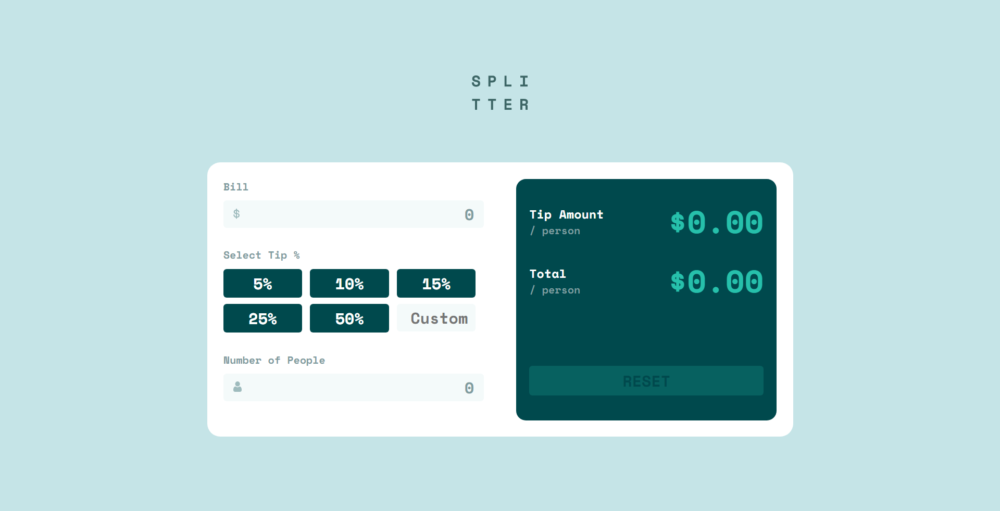

# Frontend Mentor - Tip calculator app solution

This is a solution to the [Tip calculator app challenge on Frontend Mentor](https://www.frontendmentor.io/challenges/tip-calculator-app-ugJNGbJUX). Frontend Mentor challenges help you improve your coding skills by building realistic projects.

## Table of contents

-   [Overview](#overview)
    -   [The challenge](#the-challenge)
    -   [Screenshot](#screenshot)
    -   [Links](#links)
-   [My process](#my-process)
    -   [Built with](#built-with)
    -   [What I learned](#what-i-learned)
    -   [Continued development](#continued-development)
    -   [Useful resources](#useful-resources)
-   [Author](#author)
-   [Acknowledgments](#acknowledgments)

**Note: Delete this note and update the table of contents based on what sections you keep.**

## Overview

### The challenge

Users should be able to:

-   View the optimal layout for the app depending on their device's screen size
-   See hover states for all interactive elements on the page
-   Calculate the correct tip and total cost of the bill per person

### Screenshot



<!-- Add a screenshot of your solution. The easiest way to do this is to use Firefox to view your project, right-click the page and select "Take a Screenshot". You can choose either a full-height screenshot or a cropped one based on how long the page is. If it's very long, it might be best to crop it.

Alternatively, you can use a tool like [FireShot](https://getfireshot.com/) to take the screenshot. FireShot has a free option, so you don't need to purchase it.

Then crop/optimize/edit your image however you like, add it to your project, and update the file path in the image above. -->

**Note: Delete this note and the paragraphs above when you add your screenshot. If you prefer not to add a screenshot, feel free to remove this entire section.**

### Links

-   Solution URL: [Solution URL](https://github.com/PaingMinSoe/tips-calculator-app)
-   Live Site URL: [Live Site URL](https://tips-calculator-app-two.vercel.app/)

## My process

### Built with

-   Semantic HTML5 markup
-   CSS custom properties
-   Flexbox
-   CSS Grid
-   Mobile-first workflow

**Note: These are just examples. Delete this note and replace the list above with your own choices**

### What I learned

I got to use Regular Expression in JavaScript. I have also learnt to use SCSS for the design of the project. I have also learnt about Event in JavaScript and how they can be used to make animation or changes in the project.

To see how you can add code snippets, see below:

```html
<h1>Some HTML code I'm proud of</h1>
```

```css
.container .card .right .result-box .reset-btn {
    margin-top: 75px;
    width: 100%;
    font-size: 24px;
    padding: 5px;
    border-radius: 5px;
    text-align: center;
    border: none;
    background: hsl(172, 67%, 45%);
    color: hsl(183, 100%, 15%);
    transition: ease-in-out 0.1s;
}
.container .card .right .result-box .active-btn:hover {
    background: hsl(189, 41%, 97%);
}
.container .card .right .result-box .inactive {
    opacity: 0.2;
}
```

```js
for (let index = 0; index < inputs.length; index++) {
    const element = inputs[index];

    const error = errors[index];

    var previous_value = element.value;

    element.addEventListener("input", function () {
        console.log(validNumber.test(element.value));

        if (element == document.getElementById("bill-input")) {
            bill = element.value;
        } else if (element == document.getElementById("tip-input")) {
            tip = element.value;
        } else if (element == document.getElementById("people-input")) {
            people = element.value;
            console.log(people);
        }

        if (element.value == "0") {
            element.value = previous_value;

            element.classList.add("shake");
            error.innerHTML = "Can't be Zero";
            setTimeout(function () {
                element.classList.remove("shake");
                error.innerHTML = "";
            }, 1000);
        } else if (!validNumber.test(element.value)) {
            element.value = previous_value;

            element.classList.add("shake");
            error.innerHTML = "Only number allowed";
            setTimeout(function () {
                element.classList.remove("shake");
                error.innerHTML = "";
            }, 1000);
        } else {
            previous_value = element.value;
        }

        if (bill > 0 && tip > 00 && people > 0) {
            var tip_amount = (bill * (tip / 100)) / people;
            var total = tip_amount + bill / people;

            document.getElementById("tip-amount-value").innerHTML =
                "$" + Math.floor(tip_amount * 100) / 100;
            document.getElementById("total-value").innerHTML =
                "$" + Math.ceil(total * 100) / 100;

            console.log(parseFloat(tip_amount).toFixed(2));
            console.log(parseFloat(total).toFixed(2));

            document.getElementById("reset-btn").classList.add("active-btn");
            document.getElementById("reset-btn").classList.remove("inactive");
        }
    });
}
```

If you want more help with writing markdown, we'd recommend checking out [The Markdown Guide](https://www.markdownguide.org/) to learn more.

**Note: Delete this note and the content within this section and replace with your own learnings.**

### Continued development

Right now, the desktop design uses pixel value for width and height and other properties. The elements do not excatly align but quite similar to the design. I would try to improve on the responsiveness of the project. Currently, the JS code is also quite a mess and there's a lot of if loops for validation and other aspects. I would try to clean up them.

**Note: Delete this note and the content within this section and replace with your own plans for continued development.**

### Useful resources

-   [Form Field Error Animation](https://codepen.io/biancadanforth/pen/BLYvqm) - This helped me for error animation when the input is not validated such as zero or letters.

**Note: Delete this note and replace the list above with resources that helped you during the challenge. These could come in handy for anyone viewing your solution or for yourself when you look back on this project in the future.**

## Author

-   Facebook - [Paing Min Soe](https://www.facebook.com/scrooge.ebenezer.121)
-   Frontend Mentor - [@PaingMinSoe](https://www.frontendmentor.io/profile/PaingMinSoe)
-   Twitter - [@paingminsoe224](https://twitter.com/paingminsoe224)

**Note: Delete this note and add/remove/edit lines above based on what links you'd like to share.**

## Acknowledgments

I got a lot of help from the codepen of form field animation to learn keyframes and use said keyframes for javascript error animation.

**Note: Delete this note and edit this section's content as necessary. If you completed this challenge by yourself, feel free to delete this section entirely.**
